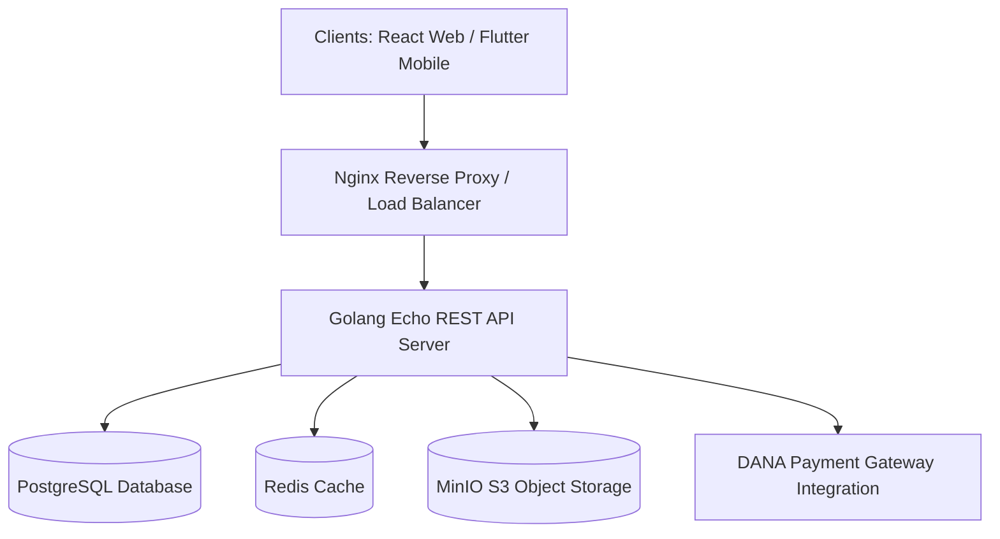
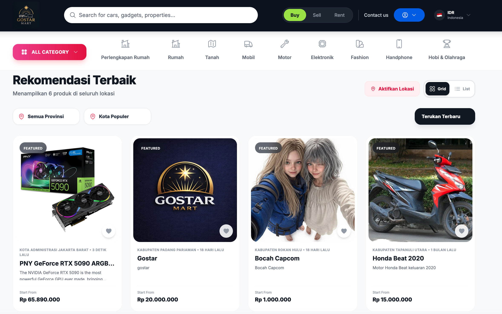
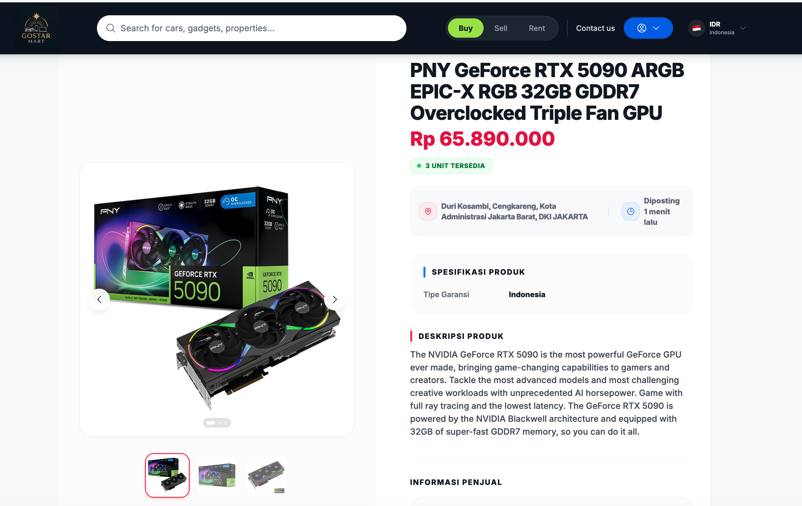
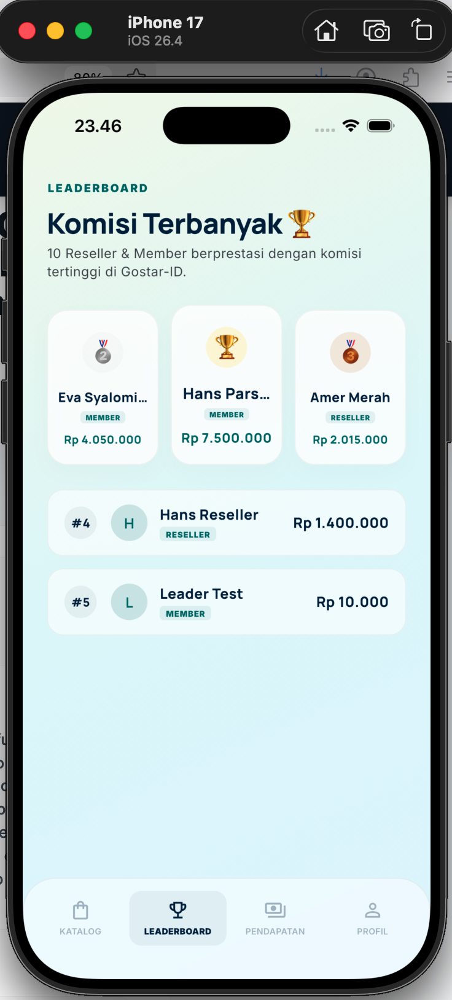
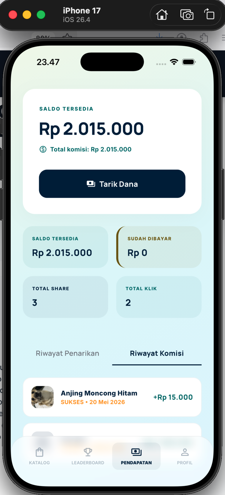
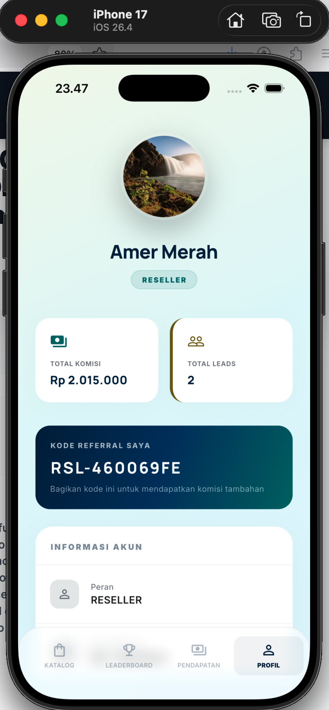

# 🛒 Gostar – Full-Stack C2C Marketplace Platform

A secure, containerized Customer-to-Customer (C2C) e-commerce marketplace and commission-tracking engine. The system is built with a **Golang (Echo)** backend, a **React (TypeScript & Vite)** web administration dashboard, **two Flutter** mobile client applications, and **MinIO (S3)** object storage, fully orchestrated via **Docker Compose** and load-balanced using **Nginx**.

---

## 🚀 Key Features

*   **Echo Backend Engine:** Robust and low-latency API handlers organized under clean architecture guidelines.
*   **Payment Gateway Integration:** Integrated payment processing APIs (including DANA e-wallet) for secure client payment loops.
*   **Commission & Reseller Tracking:** Implements structured product referral loops, automatically allocating commission credits.
*   **Multi-Client Support:** Built to power a responsive React dashboard for store administrators and resellers, as well as native mobile client apps.
*   **S3-Compatible Media Storage:** Integrates with MinIO for hosting product images and assets.
*   **Containerized Microservices:** Standardized local orchestrations with Docker Compose and Nginx reverse proxy load-balancers.
*   **Unified Developer CLI:** Configured with a root Makefile to automate local environment setup, DB migrations, testing, and audits.
*   **Automated CI/CD:** Integrated GitHub Actions workflow to run quality control audits and unit tests on every pull request/push.

---

## 🧠 System Architecture

The ecosystem separates UI dashboards, mobile components, and the core transactional backend:



---

## 📸 User Interface Preview

Here is a visual preview of the platform dashboards and mobile applications:

### 🖥️ Web Admin & Reseller Dashboards (React)
| Admin Dashboard | Reseller Portal |
| :---: | :---: |
|  |  |
| *Platform management, reseller approvals, and inventory control* | *Affiliate sales metrics, referral links, and commission withdrawals* |

### 📱 GostarID Mobile Application (Reseller Client - Flutter)
| Dashboard Screen | Sharing Screen | Wallet Screen | Analytics Screen |
| :---: | :---: | :---: | :---: |
|  |  |  |  |
| *On-the-go lead submission* | *Link sharing & tracking* | *Wallet & balances* | *Performance metrics* |

### 📱 Gostar Mart Mobile Application (Customer Client - Flutter)
| Home Screen | Product Details |
| :---: | :---: |
|  |  |
| *Customer shopping interface* | *Product search & checkouts* |

---

## 📁 Repository Directory Structure

*   **`/backend`** - Go source code (Echo framework)
    *   `/cmd/server` - Application server start entry point.
    *   `/internal/handler` - Decoupled REST API route controllers (Products, Transactions, Users, Admin).
    *   `/internal/database` - Schema definitions, migrations, and query generation logic using `sqlc`.
*   **`/frontend`** - React web application (Vite + TypeScript + TailwindCSS)
    *   `/src/pages/admin` - Private dashboard for platform administrators.
    *   `/src/pages/reseller` - Portal for affiliate resellers tracking commissions and metrics.
    *   `/src/pages/public` - Public pages (Catalog, Product Details, Auth).
*   **`/gostar-id`** - Flutter mobile application codebase for resellers/agents.
*   **`/gostar_mart`** - Flutter mobile application codebase for marketplace customers.
*   **`/nginx`** - Reverse proxy configuration maps and routing layers.
*   **`/docs`** - Comprehensive API definitions (Postman collections, Swagger specs) and troubleshooting guides.
*   **`/scripts`** - Automated shell scripts for DB migration, seeding, and MinIO storage configurations.
*   **`/.github/workflows`** - GitHub Actions CI/CD workflows for backend and frontend linting/testing.

---

## 🛠️ Technology Stack

*   **Backend:** Go (Golang 1.26+), Echo Framework, sqlc, Zerolog
*   **Frontend:** React, Vite, TypeScript, TailwindCSS, Lucide React
*   **Mobile Apps:** Flutter, Dart
*   **Databases:** PostgreSQL, Redis
*   **Storage:** MinIO (S3-compatible)
*   **API Docs:** Swagger (Swaggo)
*   **DevOps:** Docker, Docker Compose, Nginx, GitHub Actions

---

## ⚙️ Setup and Installation

### 1. Prerequisites
*   Docker & Docker Compose installed
*   Go 1.25+ (for manual local backend development)
*   NodeJS 20+ (for manual local frontend development)
*   Flutter SDK (for mobile development)

### 2. Quick Commands (Makefile)
The repository provides a root `Makefile` to simplify all common development workflows.

| Command | Description |
| :--- | :--- |
| `make dev` | Start Postgres, Redis, and MinIO container infrastructure locally |
| `make backend-run` | Launch the Golang backend server locally (development environment) |
| `make frontend-run` | Launch the React/Vite development server locally |
| `make prod-up` | Build and start the entire stack (including Nginx) in production Docker mode |
| `make prod-down` | Stop and tear down all production Docker containers |
| `make migrate-up` | Run Postgres database migrations |
| `make migrate-down` | Roll back the last database migration |
| `make db-shell` | Open a `psql` interactive shell inside the Postgres container |
| `make flutter-dev` | Run the GostarID Flutter app pointing to local backend |
| `make flutter-prod` | Run the GostarID Flutter app pointing to production backend |
| `make test` | Run backend unit tests |
| `make audit` | Run all QA checks (linter, vulnerabilities, typechecks) for backend/frontend/mobile |

---

## 🧪 Code Quality & CI/CD

To maintain high code quality standards, the repository runs automated linting and security scans.

### Local Quality Checks
You can run static code analysis, vulnerability checks, and typechecks locally:
```bash
# Run tests
make test

# Run code audit (Go staticcheck + govulncheck, React tsc, Flutter analyze)
make audit
```

### GitHub Actions CI/CD
Our GitHub Actions pipeline (`CI (Test & Audit)`) runs on every push and pull request to the `main` branch:
*   **Backend Job:** Vets Go code, runs static analysis (`staticcheck`), scans for security vulnerabilities (`govulncheck`), and executes unit tests.
*   **Frontend Job:** Installs dependencies and runs TypeScript compilation checks (`tsc --noEmit`) to verify build safety.

---

## 🛡️ License

Distributed under the MIT License. See `LICENSE` for more information.
