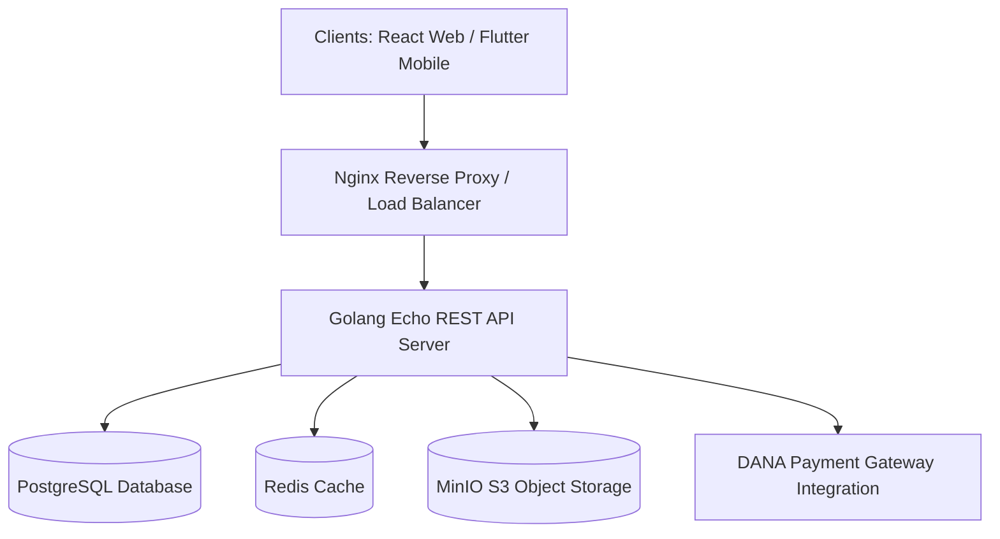

# 🛒 Gostar – Full-Stack C2C Marketplace Platform

A secure, containerized Customer-to-Customer (C2C) e-commerce marketplace and commission-tracking engine. The system is built with a **Golang (Echo)** backend, a **React (TypeScript & Vite)** web administration dashboard, a **Flutter** mobile client app codebase, and **MinIO (S3)** object storage, fully orchestrated via **Docker Compose** and load-balanced using **Nginx**.

---

## 🚀 Key Features

*   **Echo Backend Engine:** Robust and low-latency API handlers organized under clean architecture guidelines.
*   **Payment Gateway Integration:** Integrated payment processing APIs (including DANA e-wallet) for secure client payment loops.
*   **Commission & Reseller Tracking:** Implements structured product referral loops, automatically allocating commission credits.
*   **Multi-Client Support:** Built to power a responsive React dashboard for store administrators and resellers, as well as a native mobile client app codebase.
*   **S3-Compatible Media Storage:** Integrates with MinIO for hosting product images and assets.
*   **Containerized Microservices:** Standardized local orchestrations with Docker Compose and Nginx reverse proxy load-balancers.

---

## 🧠 System Architecture

The ecosystem separates UI dashboards, mobile components, and the core transactional backend:



---

## 📁 Repository Directory Structure

*   **`/backend`** - Go source code (Echo framework)
    *   `/cmd/server` - Application server start entry point.
    *   `/internal/handler` - Decoupled REST API route controllers (Products, Transactions, Users, Admin).
    *   `/internal/database` - Schema definitions, migrations, and query generation logic using `sqlc`.
*   **`/frontend`** - React web application (Vite + TypeScript + TailwindCSS)
    *   `/src/pages/admin` - Private dashboard for platform administrators.
    *   `/src/pages/reseller` - Portal for affiliate resellers tracking commissions and metrics.
    *   `/src/pages/public` - Public pages (Catalog, Product Details, Auth).
*   **`/nginx`** - Reverse proxy configuration maps and routing layers.
*   **`/docs`** - Comprehensive API definitions (Postman collections, Swagger specs) and troubleshooting guides.
*   **`/scripts`** - Automated shell scripts for DB migration, seeding, and MinIO storage configurations.

---

## 🛠️ Technology Stack

*   **Backend:** Go (Golang), Echo Framework, sqlc, Zerolog
*   **Frontend:** React, Vite, TypeScript, TailwindCSS, Lucide React
*   **Databases:** PostgreSQL, Redis
*   **Storage:** MinIO (S3-compatible)
*   **API Docs:** Swagger (Swaggo)
*   **DevOps:** Docker, Docker Compose, Nginx

---

## ⚙️ Setup and Installation

### 1. Prerequisites
*   Docker & Docker Compose installed
*   Go 1.18+ (for manual backend setup)
*   NodeJS 16+ (for manual frontend setup)

### 2. Run the Entire Stack (Docker Compose)
The easiest way to boot the backend, database, cache, MinIO storage, and Nginx proxy is via Docker Compose:
```bash
docker-compose up -d
```

### 3. Manual Local Development

#### A. Backend Setup
1. Navigate to `/backend` directory:
   ```bash
   cd backend
   ```
2. Configure credentials in `.env` (use `.env.example` as a template).
3. Run migrations and start the Go server:
   ```bash
   go run cmd/server/main.go
   ```

#### B. Frontend Setup
1. Navigate to `/frontend` directory:
   ```bash
   cd frontend
   ```
2. Install packages and boot the Vite development server:
   ```bash
   npm install
   npm run dev
   ```

---

## 🛡️ License

Distributed under the MIT License. See `LICENSE` for more information.
